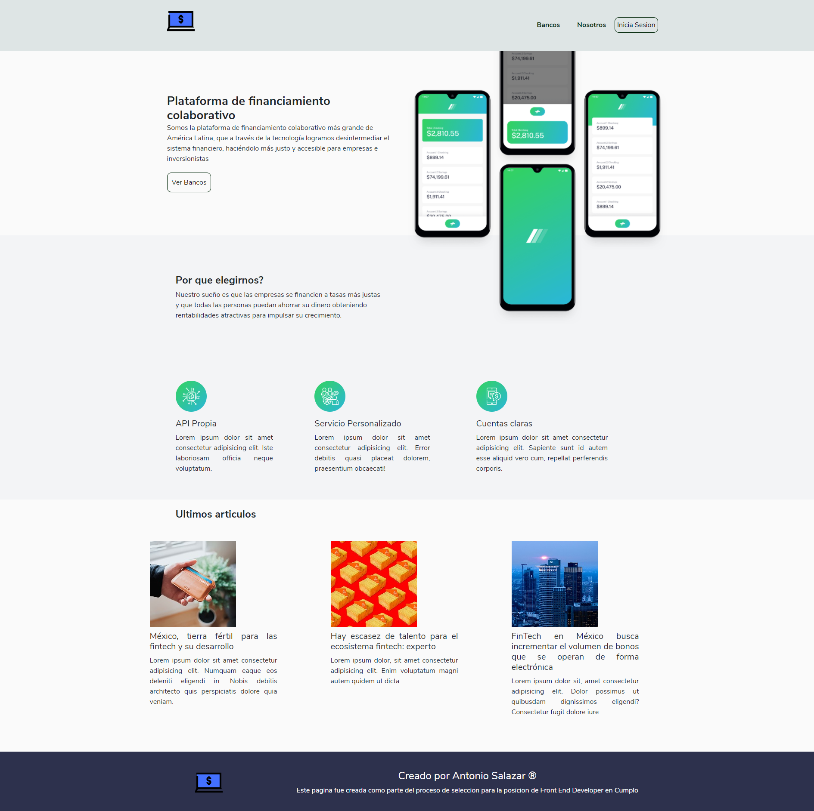

 
  
 
 Prueba tecnica realizada como parte del proceso de seleccion para la posicion de desarrollador Front End :nerd_face::computer:
 
 Retos a cubrir:
 
•	Hacer uso de algún framework JS como Vue o React. :heavy_check_mark:
 
•	El proyecto deberá ser SPA. :heavy_check_mark:
 
•	Uso de distintos componentes en una misma vista (padre e hijos). :heavy_check_mark:
 
•	Las tablas deberán de tener paginación. :heavy_check_mark:
 
•	La tabla de empleados deberá poder ordenarse por ID de empleado (asc y dec). :heavy_check_mark:
 
•	El formulario de empleado nuevo deberá de tener validación en cada campo
 
•	El nombre del empleado deberá aceptar únicamente letras, acentos y espacios.
 
•	El nombre del empleado debe ser obligatorio.
 
•	No se podrá enviar un formulario vacío.
 
•	El empleado se liga a cada sucursal por el campo ID de la sucursal.
 
•	El diseño es libre, haciendo uso de algún framework como Bootstrap, Bulma, etc. :heavy_check_mark:
 

Vista Principal:

